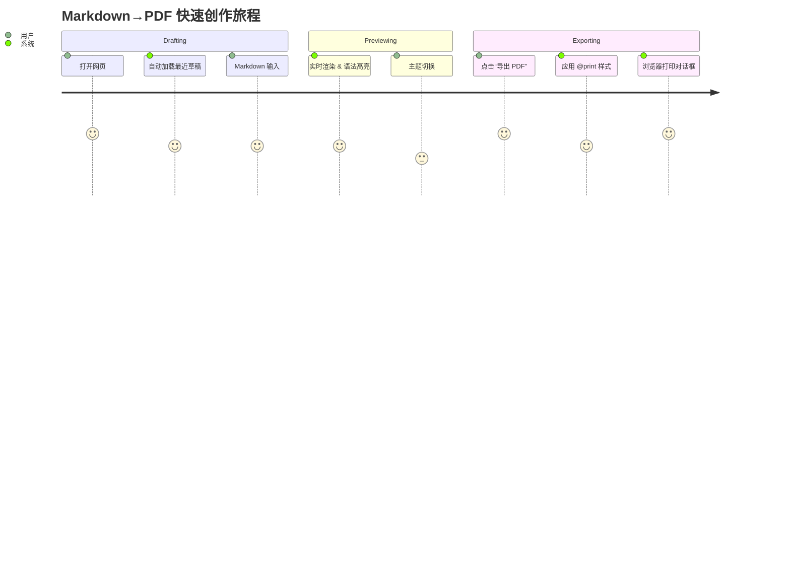
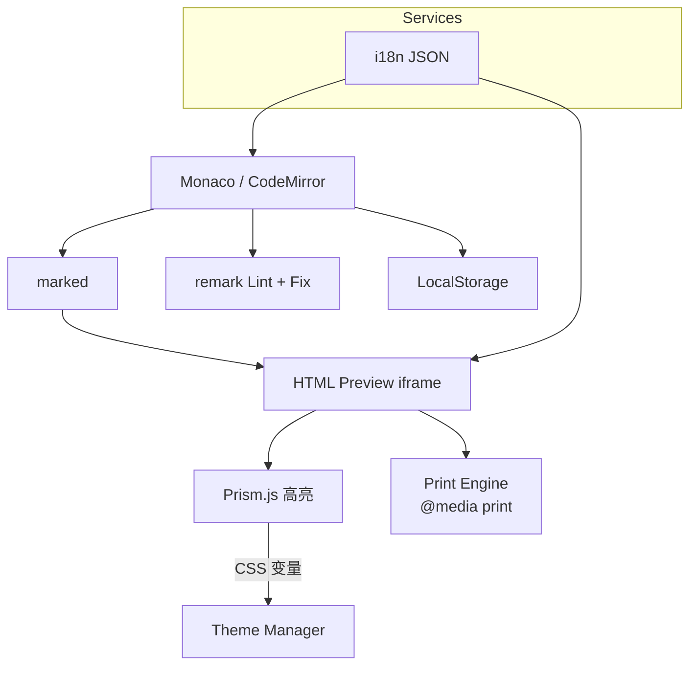

# 产品需求文档（PRD）

> **项目代号**：Markdown→PDF Editor
> **版本**：v1.1（2025‑05‑30）
> **作者**：全栈软件项目共创 & 技术开发助手
> **审阅者**：qiqi

---

## 1 概述

| 项目     | 内容                                                                 |
| -------- | -------------------------------------------------------------------- |
| 产品定位 | 零后端、纯前端的 Markdown 编辑与高质量 PDF 导出工具                  |
| 目标用户 | 个人开发者、博主、学术写作者、技术文档维护者                         |
| 核心价值 | 随时随地离线写作，所见即所得预览，多主题切换，一键生成版式一致的 PDF |
| 发布形态 | 开源 MIT，部署至 **Cloudflare Pages**；支持桌面与移动浏览器离线访问  |

---

## 2 目标与关键结果（OKR）

| Objective                                  | Key Results（T+30 天）   |
| ------------------------------------------ | ------------------------ |
| **O1 发布 MVP**                            | • 完成 P0 功能并通过验收 |
| • 首页加载 ≤ 2 s（首屏资源 ≤ 650 KB gzip） |                          |
| • PDF 与预览样式一致性 ≥ 95 %              |                          |
| **O2 良好 DX**                             | • README 五星指引        |
| • clone→build ≤ 5 min                      |                          |
| • Lighthouse 性能 ≥ 85                     |                          |

---

## 3 用户画像与场景

### 3.1 角色画像

- **自由开发者 A**：频繁撰写 README / 设计文档，需要快速导出 PDF
- **研究生 B**：编写学术笔记，偏好 Typora/Notion 风格
- **内容创作者 C**：在移动端捕捉灵感，期望随手编辑并保存草稿

### 3.2 典型用户旅程



---

## 4 需求明细

### 4.1 功能需求（MoSCoW）

| 优先级      | 模块                                                   | 用户故事 & 验收标准                          | 备注                                 |
| ----------- | ------------------------------------------------------ | -------------------------------------------- | ------------------------------------ |
| **P0**      | 编辑器（桌面：Monaco Editor；移动：CodeMirror 6 降级） | US‑01 ～ US‑07 全部通过                      | 触控设备检测 `pointer: coarse`       |
|             | 实时预览（marked + Prism）                             | 输入 ≤ 200 ms 更新                           | DOMPurify 防 XSS                     |
|             | 多主题切换                                             | 内置 GitHub / Notion / Typora / AcademicNews | 主题 CSS 同时覆盖打印                |
|             | 导出 PDF                                               | `window.print()` 调用；文档边距 0            | print.css 控制分页                   |
|             | Markdown Lint & 修复                                   | 🧹 按钮 → Diff Modal → 用户确认写入          | remark‑lint + 自定义规则，可单独启停 |
|             | 本地持久化                                             | LocalStorage 自动保存；Ctrl+S 手动保存       | IndexedDB 作为后备                   |
| **P1**      | 插件开关面板                                           | MathJax / Mermaid / Footnote 插件按需加载    | 侧边设置抽屉                         |
|             | 拖拽导入 .md                                           | 支持 >5 MB 文件 1 s 内加载                   | FileReader + 进度条                  |
| **Backlog** | 分块渲染                                               | 虚拟滚动 + IntersectionObserver              | 针对 >10 k 行大文档                  |
|             | PWA 离线安装                                           | Service Worker 缓存静态资源                  | 提升离线体验                         |

### 4.2 非功能需求

| 类别         | 指标                                                                                          |
| ------------ | --------------------------------------------------------------------------------------------- |
| **性能**     | 桌面首屏 ≤ 2 s；移动 ≤ 3 s；渲染延迟 ≤ 200 ms（桌面）/ ≤ 300 ms（移动）                       |
| **兼容性**   | 桌面：Chrome ≥ 114 / Edge ≥ 114 / Firefox ≥ 120；移动：iOS Safari ≥ 14 / Chrome Android ≥ 100 |
| **安全**     | 启用 DOMPurify 清理 HTML，禁用内联 JS                                                         |
| **可维护性** | React 18 + Vite 5；ESLint / Prettier / Husky；组件 ≤ 400 LoC                                  |
| **国际化**   | react‑i18next + 单 i18n.json；初版支持 zh‑CN / en                                             |

---

## 5 设计与原型

### 5.1 页面布局

- **桌面（≥ 768 px）**：左右分栏（编辑 50 %｜预览 50 %）
- **移动竖屏**：顶部标签页切换（编辑｜预览）
- **移动横屏**：恢复分栏
- **侧边设置抽屉**：右侧滑入，包含 Markdown 规则与插件开关

### 5.2 关键交互

- 主题、导出 PDF、修复按钮置于顶栏工具区
- 修复按钮弹出 `DiffModal`：Monaco Diff 双栏查看 → 应用/取消

---

## 6 数据结构

```jsonc
// LocalStorage
{
  "md-content": "...markdown 数据...",
  "selected-theme": "github",
  "i18n-lang": "zh-CN",
  "lint-settings": {
    "escape-asterisk": true,
    "heading-space": true,
    "fence-close": true,
  },
}
```

---

## 7 技术架构



---

## 8 依赖清单

| 组件                 | 版本 | 用途                 |
| -------------------- | ---- | -------------------- |
| React                | 18.x | UI 框架              |
| Vite                 | 5.x  | 构建工具             |
| @monaco-editor/react | ^5   | 桌面编辑器封装       |
| CodeMirror 6         | ^6   | 移动端编辑器降级     |
| marked               | ^9   | Markdown 解析（GFM） |
| Prism.js             | ^1   | 语法高亮（按需）     |
| remark-lint          | ^9   | Markdown Lint & Fix  |
| react-i18next        | ^13  | 国际化               |
| dompurify            | ^3   | HTML Sanitizer       |

---

## 9 里程碑（1 日冲刺）

| 时间     | 任务                                                                       |
| -------- | -------------------------------------------------------------------------- |
| **上午** | 初始化 Vite + React；集成 Monaco & CodeMirror 检测；完成 marked+Prism 预览 |
| **下午** | 主题系统 & print.css；LocalStorage 自动保存；Lint+Diff 修复                |
| **收尾** | i18n JSON；响应式布局；Cloudflare Pages 部署；README 发布                  |

---

## 10 验收计划

| 阶段      | 验收项                | 方法                      |
| --------- | --------------------- | ------------------------- |
| MVP 汇合  | P0 用户故事 US‑01\~07 | Playwright E2E + 手工验证 |
| 性能      | 首屏加载 & 输入延迟   | Lighthouse + WebPageTest  |
| 兼容性    | 桌面/移动主流浏览器   | BrowserStack 巡检         |
| Lint 修复 | 默认 3 条规则         | Jest 单元测试覆盖 100 %   |

---

## 11 风险与缓解措施

| 风险                   | 等级 | 缓解方案                                         |
| ---------------------- | ---- | ------------------------------------------------ |
| 各浏览器打印边距不一致 | 中   | 提示使用 Chrome + 0 边距；提供调节面板           |
| Monaco 首屏体积大      | 中   | 使用 vite‑plugin‑monaco-editor 拆分 worker + CDN |
| 大文件 diff 渲染卡顿   | 中   | 限制 DiffModal 行数折叠；计划采用虚拟滚动        |
| 新手移动端输入体验     | 中   | 自动降级 CodeMirror 6；优化触控快捷键            |

---

## 12 未来迭代（Backlog）

1. 分块渲染（虚拟滚动、IntersectionObserver）
2. PWA 离线安装与缓存
3. Mermaid / MathJax 插件动态加载
4. PDF/PNG 无对话框导出（html2pdf.js / Edge Worker）
5. 键盘快捷键 & 专注模式

---

> **文档状态**：已确认 PRD v1.1，待批准后进入技术选型阶段。
