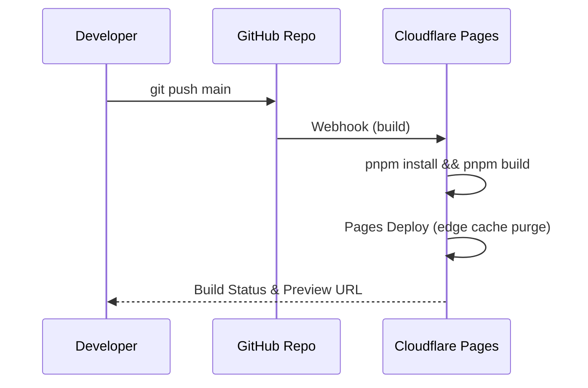

# Markdown→PDF Editor 系统架构文档

> **版本**：v1.0（2025-05-30）
> **对应阶段**：Stage 6 — API & System Architecture
> **作者**：全栈软件项目共创 & 技术开发助手

---

## 1. 架构总览

该项目为 **100% 前端 SPA**，无后端服务。所有功能在浏览器端完成，静态资源通过 **Cloudflare Pages** + 边缘 CDN 分发。下图展示了整体部署与运行时拓扑：

```mermaid
graph TD
  subgraph Client (Browser)
    A1[React UI] --> A2[Monaco Editor / CodeMirror]
    A1 --> A3[Preview iframe]
    A1 --> A4[Settings Drawer]
    A1 --> A5[i18n Engine]
    A2 --> A6[remark‑lint + Fixer]
    A3 --> A7[Prism.js Highlighter]
    A1 --> |LocalStorage / IndexedDB| L[(Web Storage)]
    A1 --> |window.print()| P[Print Engine]
  end
  C[(Cloudflare CDN)] -->|HTML / JS / CSS / Fonts| A1
  style L fill:#fff,stroke:#888,stroke-dasharray: 5 5
```

* **静态托管 (Cloudflare Pages)**：构建产物经自动 CI 发布，全球节点缓存；首次访问平均 < 150 ms。
* **边缘缓存策略**：`Cache‑Control: public, max-age=31536000` 对 `*.js`/`*.css`；HTML 5 分钟。
* **安全沙箱**：预览 iframe 加 `sandbox="allow‑same‑origin"`，并使用 **DOMPurify** 清洗渲染结果。

---

## 2. 本地存储设计

| Key                        | 说明                      | 类型               | 生命周期  |
| -------------------------- | ----------------------- | ---------------- | ----- |
| `md-content`               | Markdown 文本内容           | `string`         | 持久    |
| `selected-theme`           | 当前主题 key                | `string`         | 持久    |
| `i18n-lang`                | 语言选项                    | `string`         | 持久    |
| `lint-settings`            | Lint 规则布尔映射             | `object`         | 持久    |
| `draft‑timestamp`          | 最近保存时间                  | `number` (epoch) | 持久    |
| `__idb_assets` (IndexedDB) | 大于 5 MB 的 Markdown 文件缓存 | `Blob`           | 用户清理前 |

---

## 3. 内部模块接口 (TypeScript 约定)

> 虽无后端 OpenAPI，但前端模块之间需要稳定接口。核心接口如下：

```ts
/** markdown.service.ts */
export interface MarkdownService {
  parse(md: string): Promise<string>; // 返回 HTML 字符串
  highlight(html: string): Promise<string>; // Prism 高亮
}

/** lint.service.ts */
export interface LintRuleResult {
  message: string;
  line: number;
  fix?: () => void; // 应用修复
}
export interface LintService {
  run(md: string): Promise<LintRuleResult[]>;
  applyFixes(md: string, results: LintRuleResult[]): string;
}

/** storage.service.ts */
export interface StorageService {
  save(key: string, value: any): void;
  load<T = any>(key: string): T | null;
  clear(): void;
}
```

---

## 4. 打印 & PDF 流程

1. 用户点击 **导出 PDF** 按钮。
2. 应用当前主题的 `print.css` 覆写：隐藏编辑器、顶栏、设置抽屉。
3. 调用 `window.print()` → 浏览器原生打印对话框。
4. 用户选择 **保存为 PDF**。
5. 回调 (`afterprint`) 恢复页面样式。

> **后续扩展**：若引入 `html2pdf.js`，将在客户端额外拉取 200 KB 脚本，并通过 canvas 渲染成 PDF，无需对话框。

---

## 5. 分块渲染（Backlog Feature）

* **触发阈值**：Markdown 文本行数 > 10 k。
* **机制**：

  1. 编辑器滑动事件节流至 60 fps；
  2. 使用 `IntersectionObserver` 监听预览区域；
  3. 仅渲染首屏 + 预留两屏缓冲的 HTML；其余转为占位 `div`；
  4. 当缓存列表 ≥ 1000 个节点时进行 LRU 回收。

---

## 6. CI / CD 流程



* **分支策略**：`main` → 生产；`dev` → 日常集成。Pull Request 触发 Preview 环境。
* **测试门槛**：CI 中运行 `vitest` + `playwright headless`；若单元/端到端失败，阻断部署。

---

## 7. 安全与合规

| 范畴  | 做法                                                                   |
| --- | -------------------------------------------------------------------- |
| XSS | DOMPurify 3.x + iframe sandbox；禁止 `script`, `on*` 属性                 |
| 权限  | 无后端，无存储用户数据；隐私风险极低                                                   |
| CSP | `Content-Security-Policy: default-src 'self' https:; img-src data:;` |

---

> **结论**：本系统架构充分满足“零后端、极简、移动适配、安全沙箱”四大目标，且为后续 PWA、分块渲染等迭代预留扩展点。

---

*如需修改，请在 Canvas 批注或聊天提出；确认无误后将进入 Stage 7（实施计划 & 开发指导）。*
